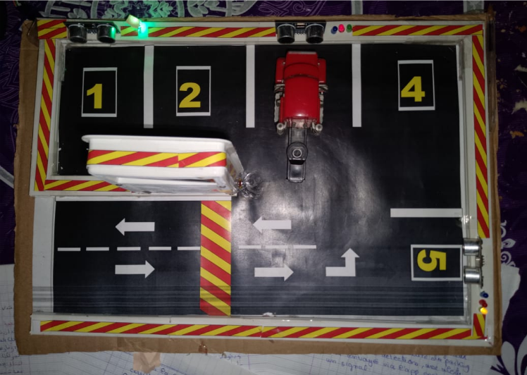
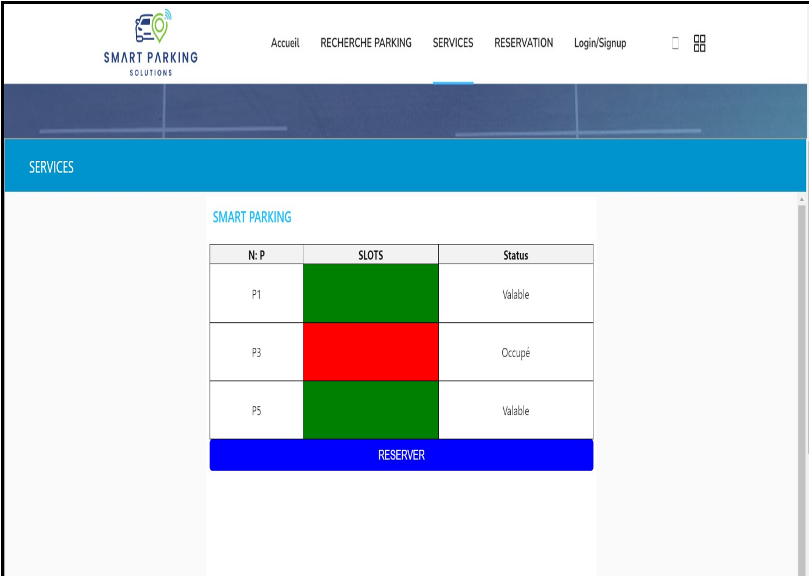
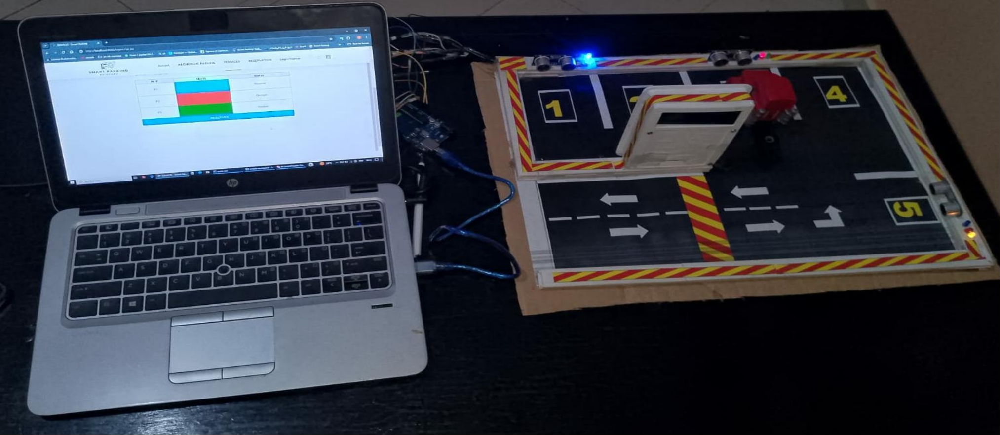
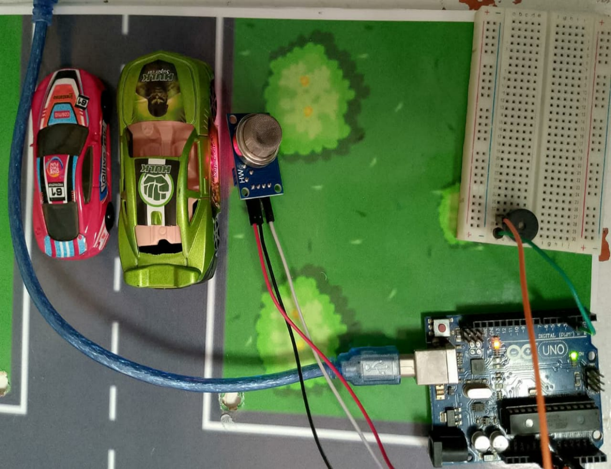

# 🅿️ Smart Parking IoT — Système de Stationnement Intelligent

**Une solution innovante de gestion de parking utilisant l’Internet des Objets (IoT)**

---

## 📸 Résultats et Visualisations

### 🔹 Prototype Réel du Parking

### 🔹 Application Web — Tableau de Bord

### 🔹 Prototype de détection de gaz

---

## 📖 Table des Matières
- [🎯 Aperçu du Projet](#-aperçu-du-projet)
- [🚀 Fonctionnalités](#-fonctionnalités)
- [🛠️ Technologies Utilisées](#️-technologies-utilisées)
- [🏗️ Architecture du Système](#️-architecture-du-système)
- [🎮 Utilisation](#-utilisation)
- [🔧 Configuration](#-configuration)
- [👥 Auteur](#-auteur)
- [📄 Licence](#-licence)

---

## 🎯 Aperçu du Projet

Le **Smart Parking IoT** est une solution intelligente de gestion de stationnement exploitant les technologies **IoT** pour faciliter la recherche et la gestion des places de parking en temps réel.  
Grâce à une **application web intuitive**, les utilisateurs peuvent consulter la disponibilité des places, effectuer des réservations et recevoir des alertes de sécurité.

### 🌟 Problématiques Résolues
- ✅ Recherche rapide des places disponibles  
- ✅ Réduction du temps de stationnement  
- ✅ Économie de carburant et réduction de la pollution  
- ✅ Sécurité renforcée (détection de gaz)  
- ✅ Gestion optimisée et centralisée du parking  

---

## 🚀 Fonctionnalités

### 🔑 Principales
- 🔐 **Authentification sécurisée** des utilisateurs  
- 📊 **Visualisation en temps réel** des places (libre / occupée / réservée)  
- 📅 **Réservation en ligne** via l’application web  
- 🚨 **Détection de fuites de gaz** avec alarme sonore  
- 📱 **Interface responsive** accessible sur tous les appareils  

### 💡 Indications Visuelles
| Couleur | Signification |
|----------|---------------|
| 🟢 LED Verte | Place disponible |
| 🔴 LED Rouge | Place occupée |
| 🔵 LED Bleue | Place réservée |
| 📟 LCD | Affichage des informations en temps réel |

---

## 🛠️ Technologies Utilisées

### 💻 **Matériel (Hardware)**
| Composant | Description |
|-----------|-------------|
| **Arduino Uno** | Microcontrôleur principal |
| **Capteur Ultrason HC-SR04** | Détection de présence véhicule |
| **Capteur de Gaz MQ-2** | Détection de fuites de gaz |
| **Afficheur LCD** | Informations du parking |
| **LEDs (Rouge/Vert/Bleu)** | Indicateurs visuels |
| **Buzzer** | Alerte sonore |
| **Breadboard** | Prototypage des circuits |

### 🌐 **Logiciel (Software)**
| Technologie | Utilisation |
|-------------|-------------|
| **Java / Java EE** | Backend de l’application |
| **HTML / CSS / JavaScript** | Interface web |
| **MySQL** | Base de données |
| **Node-RED** | Communication IoT |
| **Arduino IDE** | Programmation des capteurs |
| **Apache Tomcat** | Serveur web |
| **Eclipse IDE** | Développement et déploiement |

---

## 🏗️ Architecture du Système

graph TD
    A[Capteurs Ultrason] --> B[Arduino Uno]
    C[Capteur Gaz MQ-2] --> B
    D[LEDs Indicateurs] --> B
    B --> E[Node-RED]
    E --> F[Base de Données MySQL]
    F --> G[Application Web]
    G --> H[Utilisateur Final]

## 📋 Description des Couches

Couche Capteurs → collecte de données en temps réel

Couche Contrôleur → traitement via Arduino & Node-RED

Couche Données → stockage dans MySQL

Couche Application → interface web utilisateur

Couche Sécurité → authentification & système d’alerte
---

##  📦 Installation
### ⚙️ Prérequis

Arduino IDE 1.8.x ou supérieur

Java JDK 8+

Apache Tomcat 9+

MySQL 5.7+

Node-RED

## 🎮 Utilisation
## 👤 Utilisateur

Accéder à l’application : http://localhost:8080/smartparking

Créer un compte / se connecter

Consulter les places disponibles

Réserver une place libre

Stationner et visualiser les alertes en temps réel

👥 Auteur

👩‍💻 Zineb Drissi
🎓 Licence Sciences Mathématiques et Informatique
📍 Faculté des Sciences Ben M’Sick — Promotion 2023/2024

📄 Licence

Projet académique réalisé dans le cadre d’un projet de fin d’études.
Licence MIT — libre d’utilisation à des fins éducatives.